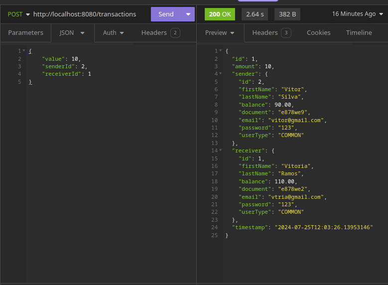

# PicPay Simulator - API with Spring Boot

This is a project for a simplified API that simulates basic functionality of PicPay. Users can perform transactions with each other, and there is a mock service to simulate transaction authorization.
- [Link to the challenge GitHub](https://github.com/PicPay/picpay-desafio-backend)

## Table of Contents

- [About the Project](#about-the-project)
- [Features](#features)
- [Prerequisites](#prerequisites)
- [Installation](#installation)
- [Usage](#usage)
- [Project Structure](#project-structure)
- [Technologies Used](#technologies-used)
- [Authorization Service Mock](#authorization-service-mock)
- [Contributing](#contributing)
- [License](#license)

## About the Project

This project was developed to simulate basic operations of transactions between users, similar to PicPay. It includes a mock authorization service to validate transactions.
There were issues with the mock related to notifications, so I was unable to implement it.

## Features

- User creation
- Performing transactions between users
- Mock authorization service for transaction validation

## Prerequisites

To run this project, you will need to have the following installed:

- Java 17 or higher
- Maven
- H2Database (or another database of your choice)

## Installation

1. Clone the repository:
```bash
git clone https://github.com/vt-mxs/simple-picpay
cd simple-picpay
```

2. Configure the database:

Create a database with H2Database and adjust the settings in the `application.properties` file located at `src/main/resources`:
```properties
spring.datasource.url = jdbc:h2:mem:test_mem
spring.datasource.driver-class-name = org.h2.Driver
spring.datasource.username = your-username
spring.datasource.password = password (can be left empty)
spring.jpa.database-platform = org.hibernate.dialect.H2Dialect
spring.h2.console.enabled = true
```

3. Build and run the application:
```bash
mvn clean install
mvn spring-boot:run
```
- Note: If an error occurs using the commands, use an IDE to automate the process.
## Usage

The API will be available at `http://localhost:8080`. You can use tools like Postman or Insomnia to interact with the API.

### Endpoints

- **Create User:**
- `POST /user`
- Request Body:
```json
{
    "firstName": "First Name",
    "lastName": "Last Name",
    "balance": 100,
    "document": "123456",
    "email": "email@example.com",
    "password": "123",
    "type": "COMMON"
}
```


- Note: The `type` field can be `COMMON` or `MERCHANT`.

---

- **Get All Users:**
- `GET /users`


- **Perform Transaction:**
- `POST /transactions`
- Request Body:
```json
{
    "value": 10,
    "senderId": 2,
    "receiverId": 1
}
```



## Project Structure
```
picpay-simulator
├── src
│   ├── main
│   │   ├── java
│   │   │   └── com
│   │   │       └── simplepicpay
│   │   │           ├── controllers
│   │   │           │   ├── TransactionController.java
│   │   │           │   └── UserController.java
│   │   │           ├── domain
│   │   │           │   ├── transaction
│   │   │           │   │   └── Transaction.java
│   │   │           │   └── user
│   │   │           │       ├── User.java
│   │   │           │       ├── UserType.java
│   │   │           ├── dto
│   │   │           │    ├── TransactionDTO.java
│   │   │           │    ├── UserDTO.java
│   │   │           ├── infra
│   │   │           │    ├── AppConfig.java
│   │   │           ├── repositories
│   │   │           │    ├── TransactionRepository.java
│   │   │           │    ├── UserRepository.java
│   │   │           ├── services
│   │   │           │    ├── TransactionService.java
│   │   │           │    ├── UserService.java
│   │   │           └── SimplePicpayApplication.java
│   │   └── resources
│   │       └── application.properties
│   └── test
│       └── java
│           └── com
│               └── simplepicpay
│                   └── simuladorpicpay
│                       └── SimplePicpayApplicationTests.java
|
├── .gitignore
├── mvnw
├── mvnw.cmd
└── pom.xml
```

## Technologies Used

- Java
- Spring Boot
- Spring Data JPA
- Lombok
- H2Database
- Maven

## Authorization Service Mock

For simulating the authorization service, a mock was used. The mock code can be found [here](https://util.devi.tools/api/v2/authorize).

Make sure to configure and run the mock before starting the main application to ensure transactions are properly authorized.

## Contributing

Contributions are welcome! If you have any suggestions or find any issues, please open an issue or submit a pull request.